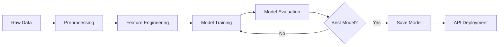

# 🏥 Medical Insurance Cost Prediction - MLOps Project

[](https://www.python.org/downloads/)
[](https://fastapi.tiangolo.com)
[](https://mlflow.org)
[](https://dvc.org)

A production-ready MLOps project for predicting medical insurance costs using machine learning, featuring automated pipelines, experiment tracking, and containerized deployment.

## 📋 Table of Contents

- [Project Overview](#project-overview)
- [Features](#features)
- [Architecture](#architecture)
- [Dataset](#dataset)
- [Installation](#installation)
- [Usage](#usage)
- [API Documentation](#api-documentation)
- [Model Performance](#model-performance)
- [Testing](#testing)
- [Docker Deployment](#docker-deployment)
- [Project Structure](#project-structure)
- [MLOps Pipeline](#mlops-pipeline)
- [Contributing](#contributing)
- [License](#license)

## 🎯 Project Overview

This project demonstrates end-to-end MLOps practices for a regression problem - predicting medical insurance costs based on patient demographics and lifestyle factors. The system includes:

- **Data Pipeline**: Automated data download, preprocessing, and versioning
- **Model Training**: Multiple ML algorithms with hyperparameter tracking
- **Experiment Tracking**: MLflow integration for experiment management
- **Model Serving**: REST API built with FastAPI
- **Containerization**: Docker support for easy deployment
- **Testing**: Comprehensive unit and integration tests
- **CI/CD Ready**: Automated pipeline orchestration with DVC

## ✨ Features

### MLOps Capabilities
- ✅ **Data Versioning** with DVC (Data Version Control)
- ✅ **Experiment Tracking** with MLflow
- ✅ **Model Registry** for model versioning
- ✅ **Automated Pipelines** for reproducibility
- ✅ **RESTful API** for model serving
- ✅ **Docker Containerization** for deployment
- ✅ **Automated Testing** with pytest
- ✅ **Code Coverage** reporting
- ✅ **Model Evaluation** with visualization
- ✅ **Configuration Management** with YAML

### Machine Learning Models
- 📊 Linear Regression (Baseline)
- 🌲 Random Forest Regressor
- 🚀 XGBoost Regressor

### API Features
- Single prediction endpoint
- Batch prediction support
- Health check endpoint
- Interactive API documentation (Swagger UI)
- Input validation with Pydantic

## 🏗️ Architecture

```
┌─────────────────┐
│  Data Source    │
│   (Kaggle)      │
└────────┬────────┘
         │
         ▼
┌─────────────────┐
│  Data Pipeline  │
│  - Download     │
│  - Preprocess   │
│  - Version      │
└────────┬────────┘
         │
         ▼
┌─────────────────┐      ┌──────────────┐
│ Model Training  │◄────►│   MLflow     │
│  - Linear Reg   │      │  Tracking    │
│  - Random Forest│      └──────────────┘
│  - XGBoost      │
└────────┬────────┘
         │
         ▼
┌─────────────────┐
│ Model Selection │
│  & Evaluation   │
└────────┬────────┘
         │
         ▼
┌─────────────────┐
│   FastAPI       │
│   REST API      │
└────────┬────────┘
         │
         ▼
┌─────────────────┐
│     Docker      │
│   Container     │
└─────────────────┘
```

## 📊 Dataset

**Source**: [Medical Insurance Cost Dataset](https://www.kaggle.com/datasets/mosapabdelghany/medical-insurance-cost-dataset) from Kaggle

### Features
- `age`: Age of the individual (18-100)
- `sex`: Gender (male/female)
- `bmi`: Body Mass Index (10-60)
- `children`: Number of dependents (0-10)
- `smoker`: Smoking status (yes/no)
- `region`: Residential area (northeast/northwest/southeast/southwest)

### Target
- `charges`: Medical insurance costs in USD

### Dataset Statistics
- **Total Samples**: ~1,338
- **Training Set**: 80% (~1,070 samples)
- **Test Set**: 20% (~268 samples)

## 🚀 Installation

### Prerequisites
- Python 3.10 or higher
- pip package manager
- Git
- Docker (optional, for containerization)

### Step 1: Clone the Repository

```bash
cd C:\Users\<YourUsername>\Workspace\medical_insurance_cost
```

### Step 2: Create Virtual Environment (Recommended)

```bash
# Windows
python -m venv venv
venv\Scripts\activate

# Linux/Mac
python -m venv venv
source venv/bin/activate
```

### Step 3: Install Dependencies

```bash
pip install -r requirements.txt
```

### Step 4: Setup Kaggle API (if not already done)

```bash
# Place your kaggle.json in the appropriate directory
# Windows: C:\Users\<YourUsername>\.kaggle\
# Linux/Mac: ~/.kaggle/

# Ensure proper permissions (Linux/Mac)
chmod 600 ~/.kaggle/kaggle.json
```

## 📖 Usage

### Complete Pipeline Execution

#### Option 1: Run Full DVC Pipeline

```bash
# Run the entire pipeline (download → preprocess → train → evaluate)
dvc repro
```

#### Option 2: Run Steps Individually

```bash
# 1. Download dataset
python download_data.py

# 2. Preprocess data
python src/data/preprocess.py

# 3. Train models
python src/models/train.py

# 4. Evaluate models
python src/models/evaluate.py
```

### Start the API Server

```bash
# Development mode with auto-reload
uvicorn src.api.app:app --reload --host 0.0.0.0 --port 8000

# Production mode
uvicorn src.api.app:app --host 0.0.0.0 --port 8000 --workers 4
```

Access the API:
- **Interactive Docs**: http://localhost:8000/docs
- **Alternative Docs**: http://localhost:8000/redoc
- **API Root**: http://localhost:8000

### View MLflow Experiments

```bash
mlflow ui --port 5000
```

Access MLflow UI at: http://localhost:5000

## 📡 API Documentation

### Endpoints

#### 1. Root Endpoint
```http
GET /
```

**Response**:
```json
{
  "message": "Medical Insurance Cost Prediction API",
  "version": "1.0.0",
  "endpoints": {
    "predict": "/predict",
    "health": "/health"
  }
}
```

#### 2. Health Check
```http
GET /health
```

**Response**:
```json
{
  "status": "healthy",
  "model_loaded": true
}
```

#### 3. Single Prediction
```http
POST /predict
```

**Request Body**:
```json
{
  "age": 35,
  "sex": "male",
  "bmi": 27.5,
  "children": 2,
  "smoker": "no",
  "region": "northwest"
}
```

**Response**:
```json
{
  "predicted_cost": 5677.34,
  "model_version": "1.0.0"
}
```

#### 4. Batch Prediction
```http
POST /batch_predict
```

**Request Body**:
```json
[
  {
    "age": 35,
    "sex": "male",
    "bmi": 27.5,
    "children": 2,
    "smoker": "no",
    "region": "northwest"
  },
  {
    "age": 45,
    "sex": "female",
    "bmi": 32.0,
    "children": 3,
    "smoker": "yes",
    "region": "southeast"
  }
]
```

**Response**:
```json
{
  "predictions": [5677.34, 38764.52],
  "count": 2
}
```

### Example API Calls

#### Using cURL

```bash
# Single prediction
curl -X POST "http://localhost:8000/predict" \
  -H "Content-Type: application/json" \
  -d '{
    "age": 35,
    "sex": "male",
    "bmi": 27.5,
    "children": 2,
    "smoker": "no",
    "region": "northwest"
  }'
```

#### Using Python

```python
import requests

url = "http://localhost:8000/predict"
data = {
    "age": 35,
    "sex": "male",
    "bmi": 27.5,
    "children": 2,
    "smoker": "no",
    "region": "northwest"
}

response = requests.post(url, json=data)
print(response.json())
```

#### Using PowerShell

```powershell
$body = @{
    age = 35
    sex = "male"
    bmi = 27.5
    children = 2
    smoker = "no"
    region = "northwest"
} | ConvertTo-Json

Invoke-RestMethod -Uri "http://localhost:8000/predict" -Method Post -Body $body -ContentType "application/json"
```

## 📊 Model Performance

### Evaluation Metrics

| Model | RMSE | MAE | R² Score | MAPE |
|-------|------|-----|----------|------|
| Linear Regression | ~6,000 | ~4,200 | ~0.75 | ~45% |
| Random Forest | ~4,800 | ~2,900 | ~0.86 | ~32% |
| **XGBoost** | **~4,500** | **~2,700** | **~0.88** | **~28%** |

*Note: Actual metrics may vary based on data split*

### Model Selection Criteria
- Primary: R² Score (coefficient of determination)
- Secondary: RMSE (Root Mean Squared Error)
- Tertiary: MAE (Mean Absolute Error)

### Visualizations

The evaluation pipeline generates the following plots:
- **Actual vs Predicted**: Scatter plot showing prediction accuracy
- **Residuals Plot**: Distribution of prediction errors
- **Error Distribution**: Histogram of residuals

View plots in: `metrics/plots/`

## 🧪 Testing

### Run All Tests

```bash
# Run tests with coverage
pytest tests/ -v --cov=src --cov-report=html --cov-report=term

# Run specific test file
pytest tests/test_api.py -v

# Run with markers
pytest tests/ -v -m "not slow"
```

### View Coverage Report

```bash
# Open HTML coverage report
# Windows
start htmlcov/index.html

# Linux/Mac
open htmlcov/index.html
```

### Test Structure

```
tests/
├── __init__.py
├── conftest.py           # Test fixtures
├── test_api.py          # API endpoint tests
└── test_preprocessing.py # Data processing tests
```

## 🐳 Docker Deployment

### Build Docker Image

```bash
# Build image
docker build -t insurance-api:latest .

# Build with custom tag
docker build -t insurance-api:v1.0.0 .
```

### Run Docker Container

```bash
# Run container
docker run -d -p 8000:8000 --name insurance-api insurance-api:latest

# Run with volume mounts
docker run -d -p 8000:8000 \
  -v $(pwd)/models:/app/models \
  -v $(pwd)/data:/app/data \
  --name insurance-api \
  insurance-api:latest

# View logs
docker logs -f insurance-api

# Stop container
docker stop insurance-api

# Remove container
docker rm insurance-api
```

### Using Docker Compose

```bash
# Start services
docker-compose up -d

# View logs
docker-compose logs -f

# Stop services
docker-compose down

# Rebuild and restart
docker-compose up -d --build
```

### Docker Hub Deployment

```bash
# Tag image
docker tag insurance-api:latest yourusername/insurance-api:latest

# Push to Docker Hub
docker push yourusername/insurance-api:latest

# Pull and run
docker pull yourusername/insurance-api:latest
docker run -d -p 8000:8000 yourusername/insurance-api:latest
```

## 📁 Project Structure

```
medical_insurance_cost/
├── 📄 README.md                    # Project documentation
├── 📄 requirements.txt             # Python dependencies
├── 📄 config.yaml                  # Configuration file
├── 📄 dvc.yaml                     # DVC pipeline definition
├── 📄 .dvcignore                   # DVC ignore patterns
├── 📄 .gitignore                   # Git ignore patterns
├── 📄 Dockerfile                   # Docker configuration
├── 📄 docker-compose.yml           # Docker Compose configuration
├── 📄 download_data.py             # Data download script
├── 📄 start_api.py                 # API startup script
├── 📄 run_pipeline.bat             # Pipeline automation (Windows)
│
├── 📂 src/                         # Source code
│   ├── 📄 __init__.py
│   ├── 📂 data/                    # Data processing modules
│   │   ├── 📄 __init__.py
│   │   └── 📄 preprocess.py       # Data preprocessing
│   ├── 📂 models/                  # Model training modules
│   │   ├── 📄 __init__.py
│   │   ├── 📄 train.py            # Model training
│   │   └── 📄 evaluate.py         # Model evaluation
│   └── 📂 api/                     # API modules
│       ├── 📄 __init__.py
│       └── 📄 app.py              # FastAPI application
│
├── 📂 data/                        # Data directory
│   ├── 📂 raw/                     # Raw data
│   │   └── 📄 insurance.csv
│   └── 📂 processed/               # Processed data
│       ├── 📄 X_train.csv
│       ├── 📄 X_test.csv
│       ├── 📄 y_train.csv
│       ├── 📄 y_test.csv
│       ├── 📄 scaler.pkl
│       └── 📄 label_encoders.pkl
│
├── 📂 models/                      # Trained models
│   └── 📄 model.pkl               # Best model
│
├── 📂 metrics/                     # Evaluation metrics
│   ├── 📄 metrics.json            # Training metrics
│   ├── 📄 evaluation.json         # Evaluation metrics
│   └── 📂 plots/                   # Visualization plots
│       ├── 📄 actual_vs_predicted.png
│       ├── 📄 residuals.png
│       └── 📄 error_distribution.png
│
├── 📂 mlruns/                      # MLflow tracking
│   └── 📂 [experiment_ids]/       # Experiment runs
│
├── 📂 tests/                       # Test suite
│   ├── 📄 __init__.py
│   ├── 📄 conftest.py
│   ├── 📄 test_api.py
│   └── 📄 test_preprocessing.py
│
├── 📂 htmlcov/                     # Coverage reports
│   └── 📄 index.html
│
└── 📂 .dvc/                        # DVC configuration
    └── 📄 config
```

## 🔄 MLOps Pipeline

### DVC Pipeline Stages

```yaml
stages:
  1. download_data    → Download dataset from Kaggle
  2. preprocess       → Clean and transform data
  3. train           → Train multiple ML models
  4. evaluate        → Evaluate and select best model
```

### Pipeline Execution Flow



### MLflow Tracking

All experiments are automatically tracked with:
- **Parameters**: Model hyperparameters
- **Metrics**: RMSE, MAE, R², MAPE
- **Artifacts**: Trained models, plots
- **Tags**: Model name, version, timestamp

### Data Versioning

DVC tracks:
- Raw data files
- Processed datasets
- Trained models
- Preprocessing artifacts

```bash
# Track data changes
dvc add data/raw/insurance.csv

# Commit DVC files
git add data/raw/insurance.csv.dvc .gitignore
git commit -m "Add raw data"

# Push to remote storage
dvc push
```

## 🛠️ Configuration

### config.yaml Structure

```yaml
project:
  name: "medical-insurance-cost-prediction"
  version: "1.0.0"

data:
  raw_dir: "data/raw"
  processed_dir: "data/processed"
  test_size: 0.2
  random_state: 42

features:
  numerical: [age, bmi, children]
  categorical: [sex, smoker, region]
  target: charges

model:
  algorithms: [linear_regression, random_forest, xgboost]
  random_forest:
    n_estimators: 100
    max_depth: 10
  xgboost:
    n_estimators: 100
    max_depth: 6
    learning_rate: 0.1

mlflow:
  experiment_name: "insurance-cost-prediction"
  tracking_uri: "mlruns"

api:
  host: "0.0.0.0"
  port: 8000
```

## 🚨 Troubleshooting

### Common Issues

#### 1. Kaggle API Error
```
Error: Could not find kaggle.json
```
**Solution**: Place your `kaggle.json` in `~/.kaggle/` (Linux/Mac) or `C:\Users\<Username>\.kaggle\` (Windows)

#### 2. Import Error
```
ModuleNotFoundError: No module named 'src'
```
**Solution**: Ensure you're in the project root directory and Python path is set correctly

#### 3. Model Not Found
```
FileNotFoundError: models/model.pkl
```
**Solution**: Run the training pipeline first: `python src/models/train.py`

#### 4. Port Already in Use
```
Error: Address already in use
```
**Solution**: Use a different port: `uvicorn src.api.app:app --port 8001`

## 📝 Development Workflow

### 1. Feature Development
```bash
# Create feature branch
git checkout -b feature/new-feature

# Make changes and test
pytest tests/ -v

# Commit changes
git add .
git commit -m "Add new feature"

# Push branch
git push origin feature/new-feature
```

### 2. Experiment Tracking
```bash
# Run experiment
python src/models/train.py

# View results
mlflow ui

# Compare runs and select best model
```

### 3. Model Deployment
```bash
# Build Docker image
docker build -t insurance-api:v1.0.1 .

# Test locally
docker run -p 8000:8000 insurance-api:v1.0.1

# Deploy to production
docker push yourusername/insurance-api:v1.0.1
```

## 🤝 Contributing

Contributions are welcome! Please follow these steps:

1. Fork the repository
2. Create a feature branch (`git checkout -b feature/AmazingFeature`)
3. Commit your changes (`git commit -m 'Add some AmazingFeature'`)
4. Push to the branch (`git push origin feature/AmazingFeature`)
5. Open a Pull Request

## 📜 License

This project is licensed under the MIT License - see the [LICENSE](LICENSE) file for details.

## 👤 Author
        1. Ashish Desai
        2. Vivek Pise
        3. SACHIN GAIKWAD
        4. DINESH SINGH THAKUR
        5. JIMY PATEL
        6. MILIND MAHAJAN
        7. ASHWANI RANA

- GitHub: [@ARD-IN](https://github.com/ARD-IN)

## 🙏 Acknowledgments

- Dataset from [Kaggle](https://www.kaggle.com/datasets/mosapabdelghany/medical-insurance-cost-dataset)
- MLflow for experiment tracking
- DVC for data versioning
- FastAPI for API framework

## 📧 Contact

For questions or support, please open an issue on GitHub or contact [ashishkumar.r.desai@gmail.com](mailto:ashishkumar.r.desai@gmail.com)

**⭐ If you find this project helpful, please give it a star!**
